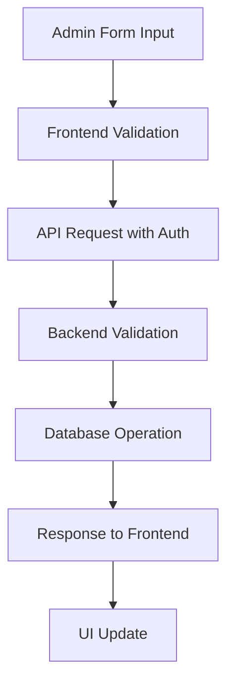

# Design Document

## Overview

The Featured Projects admin management system will extend the existing portfolio functionality to provide full CRUD (Create, Read, Update, Delete) operations for administrators. The system leverages the existing FastAPI backend with MySQL database and Next.js frontend architecture.

The design builds upon the current portfolio infrastructure:

- Existing `portfolio` table in MySQL database
- Current `/api/portfolio` GET endpoint
- Frontend portfolio display at `/portfolio` page
- Existing admin authentication system

## Architecture

### Backend Architecture

The backend follows the existing FastAPI pattern with:

- **FastAPI Framework**: RESTful API endpoints with Pydantic models
- **MySQL Database**: Existing `portfolio` table with proper indexing
- **JWT Authentication**: Leveraging existing admin authentication system
- **File Upload System**: Utilizing existing media upload infrastructure

### Frontend Architecture

The frontend extends the existing Next.js structure:

- **Next.js 14**: Server-side rendering with client components
- **TypeScript**: Type-safe development
- **Tailwind CSS**: Consistent styling with existing design system
- **Framer Motion**: Animations matching current UI patterns

### Database Schema

The existing `portfolio` table structure will be used:

```sql
CREATE TABLE portfolio (
    id INT AUTO_INCREMENT PRIMARY KEY,
    title VARCHAR(255) NOT NULL,
    description TEXT NOT NULL,
    technologies VARCHAR(500) NOT NULL,
    project_url VARCHAR(500),
    github_url VARCHAR(500),
    image_url VARCHAR(500),
    created_at TIMESTAMP DEFAULT CURRENT_TIMESTAMP,
    updated_at TIMESTAMP DEFAULT CURRENT_TIMESTAMP ON UPDATE CURRENT_TIMESTAMP
);
```

## Components and Interfaces

### Backend Components

#### 1. Portfolio API Endpoints

**Existing Endpoint (Enhanced)**:

- `GET /api/portfolio` - List all portfolio items (already exists)

**New Endpoints**:

- `POST /api/portfolio` - Create new portfolio item (admin only)
- `PUT /api/portfolio/{id}` - Update portfolio item (admin only)
- `DELETE /api/portfolio/{id}` - Delete portfolio item (admin only)

#### 2. Pydantic Models

**Existing Model (Enhanced)**:

```python
class PortfolioItem(BaseModel):
    id: int
    title: str
    description: str
    technologies: str
    project_url: Optional[str] = None
    github_url: Optional[str] = None
    image_url: Optional[str] = None
    created_at: datetime
    updated_at: Optional[datetime] = None
```

**New Models**:

```python
class PortfolioCreate(BaseModel):
    title: str
    description: str
    technologies: str
    project_url: Optional[str] = None
    github_url: Optional[str] = None
    image_url: Optional[str] = None

class PortfolioUpdate(BaseModel):
    title: Optional[str] = None
    description: Optional[str] = None
    technologies: Optional[str] = None
    project_url: Optional[str] = None
    github_url: Optional[str] = None
    image_url: Optional[str] = None
```

#### 3. Authentication Integration

Leverage existing authentication system:

- `get_current_admin()` dependency for admin-only operations
- JWT token validation using existing security infrastructure

### Frontend Components

#### 1. Admin Portfolio Management Page

**Location**: `/frontend/app/admin/portfolio/page.tsx`

**Features**:

- Portfolio items list with edit/delete actions
- "Add New Project" button
- Responsive grid layout matching existing admin pages
- Search and filter functionality

#### 2. Portfolio Form Component

**Location**: `/frontend/app/admin/portfolio/components/PortfolioForm.tsx`

**Features**:

- Form for creating/editing portfolio items
- Image upload integration with existing media system
- Form validation with error handling
- Preview functionality

#### 3. Portfolio Item Card Component

**Location**: `/frontend/app/admin/portfolio/components/PortfolioCard.tsx`

**Features**:

- Display portfolio item information
- Edit and delete action buttons
- Confirmation dialogs for destructive actions
- Responsive design

#### 4. API Integration

**Enhanced API Functions** in `/frontend/app/lib/api.ts`:

```typescript
// New functions to add
export async function createPortfolioItem(portfolioData: any);
export async function updatePortfolioItem(id: number, portfolioData: any);
export async function deletePortfolioItem(id: number);
```

## Data Models

### Portfolio Item Data Flow



### Data Validation Rules

**Title**:

- Required, 1-255 characters
- No special characters except hyphens and spaces

**Description**:

- Required, 1-2000 characters
- HTML sanitization for security

**Technologies**:

- Required, comma-separated list
- 1-500 characters

**URLs** (project_url, github_url):

- Optional, valid URL format
- HTTPS preferred

**Image URL**:

- Optional, valid URL or uploaded file path
- Integration with existing media upload system

## Error Handling

### Backend Error Handling

Following existing FastAPI error patterns:

```python
# Validation Errors
raise HTTPException(status_code=400, detail="Invalid input data")

# Authentication Errors
raise HTTPException(status_code=401, detail="Authentication required")

# Authorization Errors
raise HTTPException(status_code=403, detail="Admin access required")

# Not Found Errors
raise HTTPException(status_code=404, detail="Portfolio item not found")

# Database Errors
raise HTTPException(status_code=500, detail="Database operation failed")
```

### Frontend Error Handling

Consistent with existing error handling patterns:

```typescript
// Form validation errors
const [errors, setErrors] = useState<Record<string, string>>({});

// API error handling with user-friendly messages
try {
  await createPortfolioItem(data);
  showSuccessMessage("Portfolio item created successfully");
} catch (error) {
  showErrorMessage("Failed to create portfolio item");
}
```

### User Experience Error States

- **Loading States**: Skeleton loaders during API calls
- **Validation Errors**: Inline form field errors
- **Network Errors**: Retry mechanisms with user feedback
- **Empty States**: Helpful messages when no portfolio items exist

## Testing Strategy

### Backend Testing

**Unit Tests** (`backend/test_portfolio.py`):

- Test all CRUD operations
- Test authentication and authorization
- Test input validation and sanitization
- Test error handling scenarios

**Integration Tests**:

- Test complete API workflows
- Test database operations
- Test file upload integration

### Frontend Testing

**Component Tests** (`frontend/__tests__/portfolio/`):

- Test form validation and submission
- Test portfolio item display
- Test admin action buttons
- Test error state handling

**Integration Tests**:

- Test complete user workflows
- Test API integration
- Test authentication flows

### Manual Testing Scenarios

1. **Admin Login and Access**:

   - Verify admin can access portfolio management
   - Verify non-admin users cannot access admin features

2. **Portfolio CRUD Operations**:

   - Create new portfolio item with all fields
   - Create portfolio item with minimal required fields
   - Update existing portfolio item
   - Delete portfolio item with confirmation

3. **Form Validation**:

   - Test required field validation
   - Test URL format validation
   - Test character limits

4. **Image Upload**:

   - Test image upload and preview
   - Test image URL validation
   - Test file size and type restrictions

5. **Public Portfolio Display**:
   - Verify new items appear on public portfolio page
   - Verify deleted items are removed from public view
   - Verify updates reflect immediately

### Performance Considerations

- **Database Indexing**: Utilize existing indexes on `created_at` for sorting
- **Image Optimization**: Leverage existing media upload system
- **Caching**: Consider implementing caching for public portfolio display
- **Pagination**: Implement pagination for large portfolio collections

### Security Considerations

- **Authentication**: All admin operations require valid JWT token
- **Authorization**: Verify admin role for all management operations
- **Input Sanitization**: Sanitize all user inputs, especially descriptions
- **SQL Injection Prevention**: Use parameterized queries (existing pattern)
- **File Upload Security**: Leverage existing secure upload system
- **CORS**: Maintain existing CORS configuration
