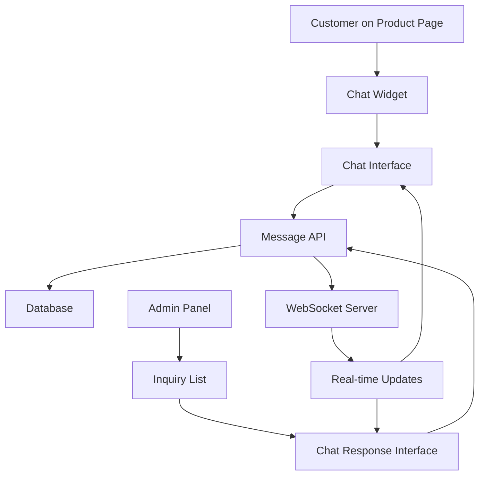

# Design Document

## Overview

This design implements a product-specific chat system that allows customers to ask questions about products directly on product detail pages. The system includes real-time messaging, message persistence, and an admin interface for responding to customer inquiries.

## Architecture

The chat system follows a client-server architecture with real-time communication capabilities:

1. **Frontend (Next.js/React)**: Chat widget on product pages, admin chat interface
2. **Backend (FastAPI)**: REST API for message handling, WebSocket support for real-time updates
3. **Database (MySQL)**: Message storage with product associations



## Components and Interfaces

### Frontend Components

#### 1. ChatWidget Component (`frontend/app/components/ChatWidget.tsx`)

- **Purpose**: Floating chat button/widget on product pages
- **Features**:
  - Minimized state: Shows chat icon with unread message count
  - Expanded state: Shows chat interface
  - Product context awareness
  - Responsive design

#### 2. ProductChat Component (`frontend/app/components/ProductChat.tsx`)

- **Purpose**: Main chat interface for product-specific conversations
- **Features**:
  - Message history display
  - Message input with send functionality
  - Product information header
  - Typing indicators
  - Message status indicators (sent, delivered, read)

#### 3. AdminChatPanel Component (`frontend/app/admin/components/AdminChatPanel.tsx`)

- **Purpose**: Admin interface for managing product inquiries
- **Features**:
  - List of pending inquiries
  - Chat interface for responding
  - Product context display
  - Customer information
  - Inquiry status management

### Backend API Endpoints

#### 1. Product Chat Messages

```python
# Get chat messages for a product
@app.get("/api/products/{product_id}/messages")
async def get_product_messages(product_id: int, session_id: str = None)

# Send a message about a product
@app.post("/api/products/{product_id}/messages")
async def send_product_message(product_id: int, message: MessageCreate)

# Mark messages as read
@app.put("/api/products/{product_id}/messages/read")
async def mark_messages_read(product_id: int, message_ids: List[int])
```

#### 2. Admin Chat Management

```python
# Get all product inquiries
@app.get("/api/admin/inquiries")
async def get_product_inquiries(status: str = "pending")

# Respond to a product inquiry
@app.post("/api/admin/inquiries/{inquiry_id}/respond")
async def respond_to_inquiry(inquiry_id: int, response: AdminResponse)

# Update inquiry status
@app.put("/api/admin/inquiries/{inquiry_id}/status")
async def update_inquiry_status(inquiry_id: int, status: str)
```

## Data Models

### Database Schema

```sql
-- Product inquiries/chat sessions
CREATE TABLE product_inquiries (
    id INT AUTO_INCREMENT PRIMARY KEY,
    product_id INT NOT NULL,
    session_id VARCHAR(255) NOT NULL, -- For anonymous users
    customer_email VARCHAR(255) DEFAULT NULL, -- Optional for follow-up
    status ENUM('pending', 'in_progress', 'resolved', 'closed') DEFAULT 'pending',
    priority ENUM('low', 'medium', 'high') DEFAULT 'medium',
    created_at TIMESTAMP DEFAULT CURRENT_TIMESTAMP,
    updated_at TIMESTAMP DEFAULT CURRENT_TIMESTAMP ON UPDATE CURRENT_TIMESTAMP,
    assigned_admin_id INT DEFAULT NULL,
    FOREIGN KEY (product_id) REFERENCES products(id) ON DELETE CASCADE,
    FOREIGN KEY (assigned_admin_id) REFERENCES users(id) ON DELETE SET NULL,
    INDEX idx_product_session (product_id, session_id),
    INDEX idx_status (status),
    INDEX idx_created_at (created_at)
);

-- Chat messages
CREATE TABLE product_messages (
    id INT AUTO_INCREMENT PRIMARY KEY,
    inquiry_id INT NOT NULL,
    sender_type ENUM('customer', 'admin') NOT NULL,
    sender_id INT DEFAULT NULL, -- Admin user ID if sender_type is admin
    message_text TEXT NOT NULL,
    message_type ENUM('text', 'system') DEFAULT 'text',
    is_read BOOLEAN DEFAULT FALSE,
    created_at TIMESTAMP DEFAULT CURRENT_TIMESTAMP,
    FOREIGN KEY (inquiry_id) REFERENCES product_inquiries(id) ON DELETE CASCADE,
    FOREIGN KEY (sender_id) REFERENCES users(id) ON DELETE SET NULL,
    INDEX idx_inquiry_created (inquiry_id, created_at),
    INDEX idx_unread (is_read, created_at)
);
```

### Pydantic Models

```python
class MessageCreate(BaseModel):
    message_text: str
    sender_type: Literal["customer", "admin"]
    session_id: Optional[str] = None
    customer_email: Optional[str] = None

class ProductMessage(BaseModel):
    id: int
    inquiry_id: int
    sender_type: str
    sender_id: Optional[int]
    message_text: str
    message_type: str
    is_read: bool
    created_at: datetime

class ProductInquiry(BaseModel):
    id: int
    product_id: int
    session_id: str
    customer_email: Optional[str]
    status: str
    priority: str
    created_at: datetime
    updated_at: datetime
    assigned_admin_id: Optional[int]
    product_name: Optional[str]  # Joined from products table
    message_count: int
    unread_count: int

class AdminResponse(BaseModel):
    message_text: str
    admin_id: int
```

## User Experience Flow

### Customer Flow

1. **Product Page Visit**

   - Customer views product detail page
   - Chat widget appears in bottom-right corner
   - Widget shows "Ask a question" prompt

2. **Chat Initiation**

   - Customer clicks chat widget
   - Chat interface opens with product context
   - System generates session ID for anonymous tracking
   - Welcome message appears with product information

3. **Conversation**

   - Customer types and sends messages
   - Messages are stored with product association
   - Real-time delivery confirmation
   - Optional email capture for follow-up

4. **Return Visits**
   - System recognizes session ID
   - Previous chat history loads
   - Conversation can continue seamlessly

### Admin Flow

1. **Inquiry Notification**

   - New product inquiries appear in admin dashboard
   - Email notifications for urgent inquiries
   - Inquiry list shows product context and preview

2. **Response Management**

   - Admin selects inquiry from list
   - Chat interface opens with full context
   - Product information displayed alongside chat
   - Admin can respond in real-time

3. **Status Management**
   - Inquiries can be marked as resolved/closed
   - Assignment to specific admin users
   - Priority levels for urgent inquiries

## Real-time Communication

### WebSocket Implementation

```python
# WebSocket connection manager
class ChatConnectionManager:
    def __init__(self):
        self.active_connections: Dict[str, WebSocket] = {}

    async def connect(self, websocket: WebSocket, session_id: str):
        await websocket.accept()
        self.active_connections[session_id] = websocket

    def disconnect(self, session_id: str):
        if session_id in self.active_connections:
            del self.active_connections[session_id]

    async def send_message(self, session_id: str, message: dict):
        if session_id in self.active_connections:
            await self.active_connections[session_id].send_json(message)

# WebSocket endpoint
@app.websocket("/ws/chat/{session_id}")
async def websocket_endpoint(websocket: WebSocket, session_id: str):
    await chat_manager.connect(websocket, session_id)
    try:
        while True:
            data = await websocket.receive_json()
            # Handle incoming messages
            await process_chat_message(data, session_id)
    except WebSocketDisconnect:
        chat_manager.disconnect(session_id)
```

## Error Handling

### Frontend Error Handling

1. **Connection Errors**: Graceful fallback to polling if WebSocket fails
2. **Message Delivery**: Retry mechanism for failed message sends
3. **Session Management**: Handle session expiration and recovery

### Backend Error Handling

1. **Database Errors**: Transaction rollback and error logging
2. **WebSocket Errors**: Connection cleanup and reconnection handling
3. **Validation Errors**: Clear error messages for invalid inputs

## Security Considerations

### Data Protection

1. **Session Security**: Secure session ID generation and validation
2. **Message Sanitization**: XSS prevention in message content
3. **Rate Limiting**: Prevent spam and abuse

### Privacy

1. **Anonymous Support**: No required user registration
2. **Data Retention**: Configurable message retention policies
3. **Email Privacy**: Optional email collection with clear consent

## Performance Optimization

### Database Optimization

1. **Indexing**: Proper indexes on frequently queried columns
2. **Pagination**: Limit message history loading
3. **Caching**: Cache frequently accessed product information

### Real-time Performance

1. **Connection Pooling**: Efficient WebSocket connection management
2. **Message Batching**: Batch multiple messages for efficiency
3. **Cleanup**: Regular cleanup of inactive connections

## Testing Strategy

### Unit Tests

1. **Message API**: Test message creation, retrieval, and updates
2. **WebSocket**: Test connection management and message delivery
3. **Admin Functions**: Test inquiry management and responses

### Integration Tests

1. **End-to-End Chat**: Test complete customer chat flow
2. **Admin Workflow**: Test admin response and management flow
3. **Real-time Updates**: Test WebSocket message delivery

### Performance Tests

1. **Concurrent Connections**: Test multiple simultaneous chats
2. **Message Volume**: Test high-volume message handling
3. **Database Load**: Test database performance under load

## Implementation Phases

### Phase 1: Basic Chat Infrastructure

- Database schema creation
- Basic message API endpoints
- Simple chat widget component

### Phase 2: Real-time Communication

- WebSocket implementation
- Real-time message delivery
- Connection management

### Phase 3: Admin Interface

- Admin chat panel
- Inquiry management
- Response functionality

### Phase 4: Enhanced Features

- Email notifications
- Message status indicators
- Advanced admin features

## Design Decisions and Rationales

1. **Session-based Tracking**: Allows anonymous users without requiring registration
2. **Product Association**: Links conversations to specific products for context
3. **WebSocket + REST**: Combines real-time updates with reliable API endpoints
4. **Separate Inquiry Table**: Allows for better organization and admin management
5. **Flexible Status System**: Supports various inquiry states and workflows
