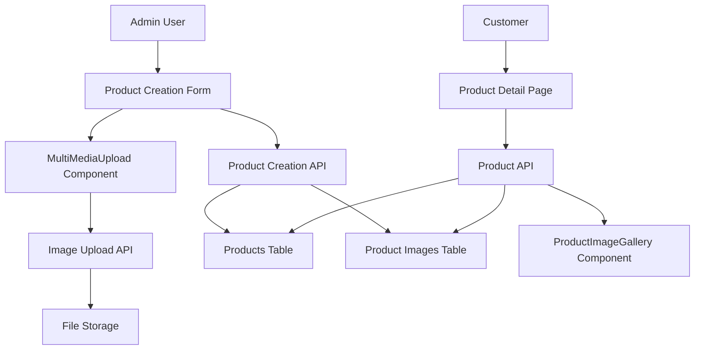

# Design Document

## Overview

This design addresses the multiple image upload functionality for products by fixing the integration between the frontend MultiMediaUpload component and the backend API. The solution involves updating the frontend to properly collect multiple image URLs and modifying the backend to correctly process and store them in the product_images table.

## Architecture

The system follows a three-tier architecture:

1. **Frontend (Next.js/React)**: Product creation form with MultiMediaUpload component
2. **Backend (FastAPI)**: API endpoints for product creation and image handling
3. **Database (MySQL)**: Products table with related product_images table



## Components and Interfaces

### Frontend Components

#### 1. Product Creation Form (`frontend/app/admin/products/create/page.tsx`)

- **Current Issue**: Only handles single `image_url` instead of multiple `image_urls`
- **Solution**: Update form state to handle `image_urls` array
- **Changes**:
  - Modify `formData` state to include `image_urls: string[]`
  - Update `handleMediaSelect` to collect all image URLs
  - Remove single `image_url` field dependency

#### 2. MultiMediaUpload Component

- **Current Status**: Already functional for selecting multiple images
- **Integration**: Needs to properly pass all selected image URLs to parent component

#### 3. ProductImageGallery Component

- **Current Issue**: Expects `images` array but backend returns `image_urls`
- **Solution**: Update to work with the correct data structure from backend

### Backend API

#### 1. Product Creation Endpoint (`/api/products`)

- **Current Issue**: Expects `image_urls` but doesn't properly save to product_images table
- **Solution**: Update to iterate through `image_urls` and save each to product_images table

#### 2. Product Retrieval Endpoint (`/api/products/{id}`)

- **Current Issue**: Returns `image_urls` array but frontend expects different structure
- **Solution**: Ensure consistent data structure between creation and retrieval

### Data Models

#### Frontend TypeScript Interfaces

```typescript
interface ProductCreate {
  name: string;
  description: string;
  category: string;
  price: number;
  stock: number;
  discount?: number;
  specifications?: string;
  image_urls: string[]; // Array of image URLs
  is_active: boolean;
}

interface ProductImage {
  id: number;
  image_url: string;
  is_primary: boolean;
}

interface Product {
  id: number;
  name: string;
  description: string;
  category: string;
  price: number;
  stock: number;
  discount?: number;
  specifications?: string;
  image_urls: string[]; // For backward compatibility
  images: ProductImage[]; // Detailed image info
  is_active: boolean;
  created_at: string;
  updated_at: string;
}
```

#### Backend Pydantic Models

```python
class ProductCreate(BaseModel):
    name: str
    description: str
    category: str
    price: float
    stock: int
    discount: Optional[float] = None
    specifications: Optional[str] = None
    image_urls: List[str] = []  # Already exists
    is_active: bool = True

class ProductImage(BaseModel):
    id: int
    image_url: str
    is_primary: bool

class Product(BaseModel):
    id: int
    name: str
    description: str
    category: str
    price: float
    stock: int
    discount: Optional[float] = None
    specifications: Optional[str] = None
    image_urls: List[str] = []
    images: List[ProductImage] = []  # Add detailed image info
    is_active: bool
    created_at: datetime
    updated_at: datetime
```

## Data Models

### Database Schema (Already Exists)

```sql
-- Products table
CREATE TABLE products (
    id INT AUTO_INCREMENT PRIMARY KEY,
    name VARCHAR(255) NOT NULL,
    description TEXT NOT NULL,
    category VARCHAR(100) NOT NULL,
    price DECIMAL(10, 2) NOT NULL,
    stock INT NOT NULL DEFAULT 0,
    discount DECIMAL(5, 2) DEFAULT NULL,
    specifications TEXT DEFAULT NULL,
    image_url TEXT DEFAULT NULL, -- Keep for backward compatibility
    is_active BOOLEAN DEFAULT TRUE,
    created_at TIMESTAMP DEFAULT CURRENT_TIMESTAMP,
    updated_at TIMESTAMP DEFAULT CURRENT_TIMESTAMP ON UPDATE CURRENT_TIMESTAMP,
    created_by INT DEFAULT NULL
);

-- Product images table (Already exists)
CREATE TABLE product_images (
    id INT AUTO_INCREMENT PRIMARY KEY,
    product_id INT NOT NULL,
    image_url TEXT NOT NULL,
    is_primary BOOLEAN DEFAULT FALSE,
    created_at TIMESTAMP DEFAULT CURRENT_TIMESTAMP,
    FOREIGN KEY (product_id) REFERENCES products(id) ON DELETE CASCADE
);
```

## Error Handling

### Frontend Error Handling

1. **Image Upload Failures**: Display error messages when image uploads fail
2. **Form Validation**: Ensure at least one image is selected before submission
3. **Network Errors**: Handle API connection issues gracefully

### Backend Error Handling

1. **Database Constraints**: Handle foreign key violations and duplicate entries
2. **Image Processing**: Validate image URLs and handle invalid formats
3. **Transaction Management**: Ensure atomicity when saving product and images

### Error Response Format

```json
{
  "detail": "Error message",
  "error_code": "PRODUCT_IMAGE_SAVE_FAILED",
  "context": {
    "product_id": 123,
    "failed_images": ["url1", "url2"]
  }
}
```

## Testing Strategy

### Unit Tests

1. **Frontend Components**:

   - Test MultiMediaUpload component with multiple images
   - Test form submission with image_urls array
   - Test ProductImageGallery with various image configurations

2. **Backend API**:
   - Test product creation with multiple images
   - Test image saving to product_images table
   - Test product retrieval with images

### Integration Tests

1. **End-to-End Flow**:
   - Upload multiple images → Create product → Verify images in database
   - Retrieve product → Verify all images are returned
   - Display product → Verify image gallery works correctly

### Test Data

- Products with 0, 1, 3, and 5+ images
- Invalid image URLs
- Large image files
- Network failure scenarios

## Implementation Approach

### Phase 1: Backend Fixes

1. Update product creation endpoint to properly save multiple images
2. Update product retrieval to include image details
3. Add error handling for image operations

### Phase 2: Frontend Updates

1. Fix product creation form to handle multiple images
2. Update ProductImageGallery component
3. Improve error handling and user feedback

### Phase 3: Testing and Validation

1. Test all scenarios with multiple images
2. Verify database consistency
3. Test user experience flows

## Design Decisions and Rationales

1. **Keep Backward Compatibility**: Maintain `image_url` field in products table for existing data
2. **Primary Image Logic**: First image in array becomes primary for consistent behavior
3. **Atomic Operations**: Use database transactions to ensure data consistency
4. **Error Recovery**: Provide clear error messages and recovery options
5. **Performance**: Lazy load images in gallery for better performance
